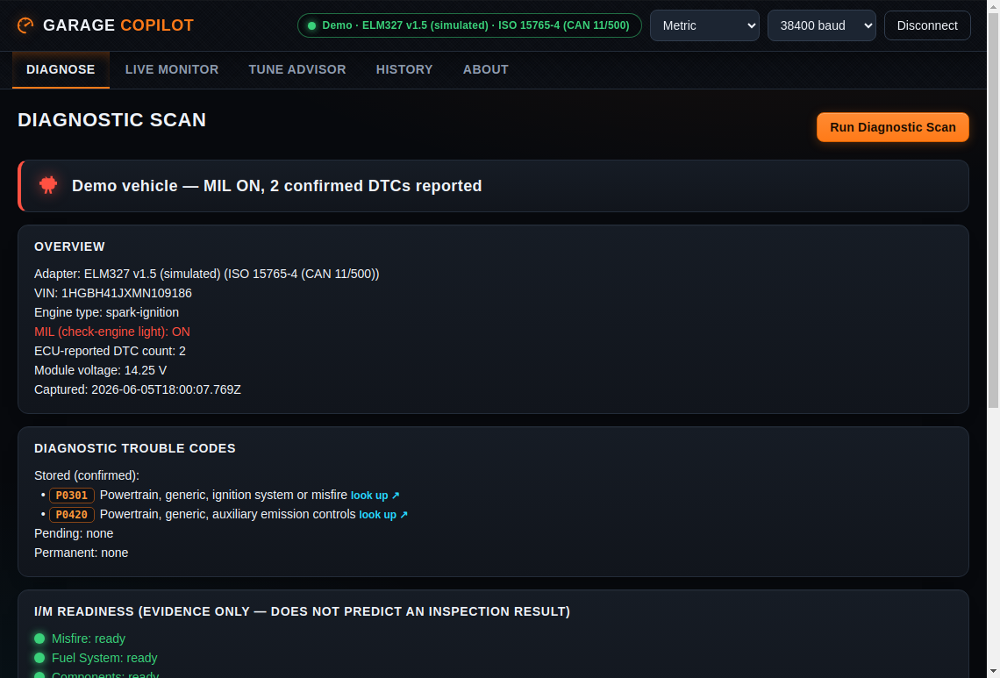
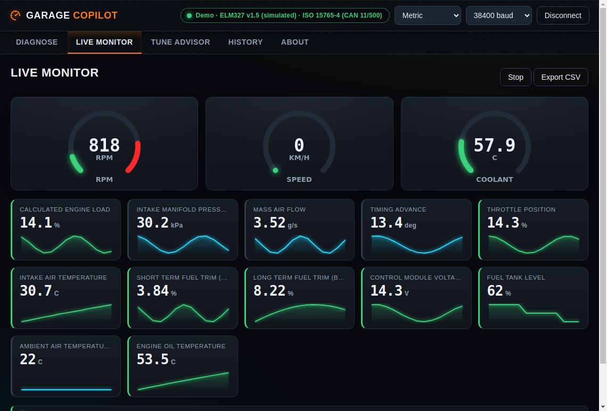
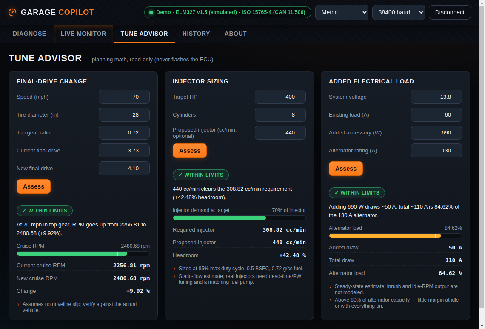
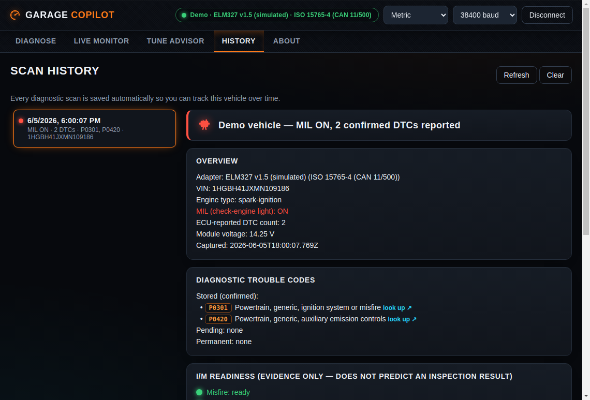
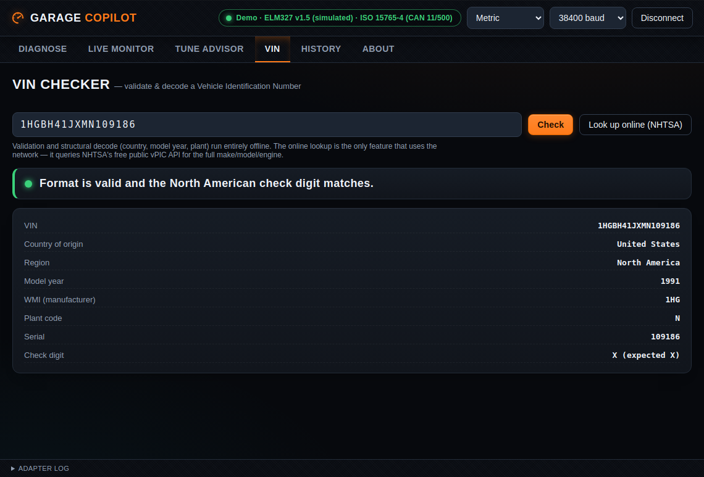

# DeepScan

A read-only desktop app for your car. Plug a standard ELM327 adapter into the
OBD-II port, open the app, and get a clear picture of what the car is reporting —
trouble codes, readiness, live data — plus live monitoring and a tune-planning
advisor. Runs on macOS, Windows, and Linux, with a professional cross-platform GUI.

This is the desktop application for DeepScan. All OBD logic comes from the tested
[engine module](../garage-copilot); this app adds the window, serial connectivity,
and the user interface.

> **Read-only.** It never clears codes, writes to the ECU, or runs active tests.
> The "tune" tools are planning math, not a flasher.

## Screens

**Diagnose** — MIL status, trouble codes (with structural decode), I/M readiness, live snapshot:



**Live Monitor** — streaming parameters with sparklines and health flags. The
gauges **adapt to your car**: on connect it discovers which PIDs the ECU actually
supports and shows those (no wasted polls on unsupported parameters):



**Tune Advisor** — validate a change (gearing, injectors, electrical load) before you commit:



**History** — every scan is saved automatically so you can track the vehicle over time:



**VIN Checker** — validate any VIN (format + North-American check digit) and decode
its structure (country, model year, plant) entirely offline; the car's VIN auto-fills
after a scan. An optional one-click **online lookup** queries NHTSA's vPIC API for the
full make/model/engine.



There's also a **Metric / Imperial** units toggle (°C↔°F, km/h↔mph, kPa↔psi, …)
that applies across the report, live gauges, and saved scans.

## Run it

```bash
cd apps/garage-copilot-desktop
npm install
npm start          # builds the engine + app, then launches the GUI
```

`npm start` opens the window. Click **Demo mode** to explore with a simulated
vehicle (no hardware), or **Connect OBD-II** to use a real adapter.

### Connect to your car

1. Plug an **ELM327** adapter into the OBD-II port (USB, or pair a Bluetooth one
   so it shows up as a serial port). Turn the ignition to ON (engine running for
   live data).
2. macOS: USB clones usually need the **CH340** or **FTDI** driver installed once.
3. Click **Connect OBD-II** and pick your adapter from the list.

The app talks to the adapter via the **Web Serial API** through Electron's native
port picker — there's no native serial module to compile, so nothing to rebuild.

### Build installers (macOS, Windows, Linux)

`npm run dist` packages the app for **whichever OS you run it on** (output lands
in `release/`):

| Run on… | You get                        |
| ------- | ------------------------------ |
| macOS   | `.dmg` + `.zip`                |
| Windows | NSIS installer `.exe` + `.zip` |
| Linux   | `.AppImage` + `.deb`           |

```bash
npm run dist
```

Electron apps can't be cross-built (you can't make a Mac `.dmg` on Windows, etc.),
so each platform is built on its own OS. To build **all three at once**, run the
**desktop-release** GitHub workflow (Actions tab → _Run workflow_, or push a `v*`
tag); it builds on native macOS/Windows/Linux runners and uploads each platform's
installers as artifacts.

These are **unsigned** builds: macOS Gatekeeper and Windows SmartScreen will warn
until you configure code signing (and notarization on macOS) for distribution.

## Architecture

```
Electron main (tiny)          Renderer (the GUI)
─────────────────────         ───────────────────────────────
window + serial picker  ◀──▶  Web Serial ▶ DeepScan engine
(select-serial-port)          (WebSerialTransport)   (diagnose/
                              ReplayTransport (demo)  monitor/tune)
```

- **Main process** only creates the window and drives the OS serial-port picker.
  No OBD logic, no native modules.
- **Renderer** does everything else: it opens the dongle over Web Serial, runs
  the engine's real ELM327 driver and decoders, and renders the results. The
  engine is bundled in from [`../garage-copilot`](../garage-copilot)'s built
  output, so the GUI and CLI share identical, tested logic.
- **Demo mode** swaps the Web Serial transport for the engine's replay transport,
  so the entire UI works with no hardware.

## Security

The app follows the Electron security checklist and is locked to its single job
(read OBD-II over Web Serial), so the attack surface stays tiny:

- **Renderer isolation** — `contextIsolation` + `sandbox` on, `nodeIntegration`
  off, and `webSecurity` / `allowRunningInsecureContent` / `experimentalFeatures`
  pinned explicitly so a future Electron default can't weaken them.
- **CSP** — set both as a `<meta>` and as a response header; everything is
  `'self'`. The only outbound exception is `connect-src https://vpic.nhtsa.dot.gov`
  for the opt-in VIN lookup — no other network access is possible.
- **No drifting** — `will-navigate` / `will-redirect` are blocked, and external
  links open in the OS browser only if they pass a strict https allowlist
  (rejects `http:`, embedded credentials, and look-alike hosts).
- **Least privilege** — every permission request is denied except Web Serial;
  IPC messages from any non-`file://` frame are rejected.
- **Hardened binary** — packaging flips Electron fuses (no RunAsNode, no Node
  CLI inspector, cookie encryption) via the `afterPack` hook.
- **Dropped adapter** — an unplugged dongle surfaces a clear "disconnected"
  message instead of a silently frozen UI.

## Develop

```bash
npm run typecheck
npm run build      # builds the engine, then bundles main/preload/renderer
npm test           # vitest: the Web Serial transport drives the real engine
npm run smoke      # boots the app and drives the UI (use xvfb on headless Linux)
npm run stress     # runs the live monitor under load and checks the UI stays responsive
```

### Built to stay smooth

The live monitor is designed not to drift or freeze over a long session:

- The sample buffer is bounded (rolling window), so memory and per-tick trend
  analysis stay flat no matter how long you watch.
- Commands are serialized through a queue (the OBD link is half-duplex) with an
  in-flight guard, so a slow adapter can't back up or overlap rounds.
- Per-command timeouts fail fast on a dead adapter (~4s) while still giving
  protocol negotiation room (~12s).
- Card refs are cached and the adapter-log render is coalesced to one DOM write
  per frame, so nothing thrashes layout.
- All OBD I/O is async (Web Serial), so it never blocks the UI thread — the
  stress harness measures ~0ms main-thread lag across a sustained run.

The Web Serial transport is unit-tested by feeding the real driver scripted
responses through in-memory Web Streams; the headless smoke test boots Electron,
clicks through Demo connect → scan → advisor, and asserts the UI wired up.

## Troubleshooting

- **No ports listed:** confirm the adapter is plugged in and its USB-serial
  driver (CH340/FTDI) is installed; replug and retry.
- **Connects but "NO DATA":** ignition must be ON; some cheap clones are flaky —
  an STN-based dongle (OBDLink SX/MX+) is far more reliable.
- **Wrong baud:** most clones are 38400; a few are 9600 or 115200.

## Safety & legal

Read-only by design. Everything shown is evidence to verify against service
information, not a definitive diagnosis. The tune advisor is planning math only;
flashing an ECU is done with a licensed tool, and modifying emissions-related
calibration on a road vehicle is regulated — keep performance changes to
off-road/track use.
